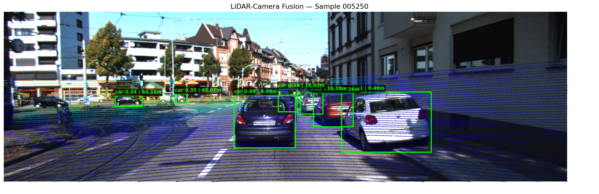

# LiDAR-Camera Sensor Fusion for ADAS

A complete multi-sensor fusion pipeline that combines 3D LiDAR point clouds 
with 2D camera images to detect, range, and track objects in real driving scenes.
Built on the KITTI dataset as part of an ADAS portfolio project.



## What This Project Does

- Projects 3D LiDAR point clouds onto 2D camera images using calibration matrices
- Runs YOLOv8 object detection on camera frames (cars, pedestrians, cyclists)
- Fuses detections with LiDAR depth via frustum extraction to estimate real-world distance
- Tracks objects across frames using a Kalman Filter + Hungarian algorithm (SORT-style)
- Produces confirmed tracks with persistent IDs and live distance updates

## Pipeline Architecture
```
LiDAR (.bin) ──► Point Cloud Projection ──────────────────┐
                  (calibration matrices)                   ▼
Camera (.png) ──► YOLOv8 Detection ──► Frustum Extraction ──► Fused Detections
                  (bounding boxes)     (depth per box)         (class + distance)
                                                               │
                                                               ▼
                                                    Kalman Filter Tracker
                                                    (persistent IDs across frames)
```

## Results

| Frame  | Confirmed Tracks | Closest Object | Farthest Object |
|--------|-----------------|----------------|-----------------|
| 000750 | 0 (initializing)| —              | —               |
| 000751 | 2               | 19.46m         | 26.39m          |
| 000752 | 5               | 15.23m         | 27.61m          |
| 000753 | 5               | 8.95m          | 27.61m          |
| 000754 | 6               | 8.95m          | 39.46m          |

## Tech Stack

- **Python 3.10**
- **OpenCV** — image loading and processing
- **NumPy** — calibration matrix math and projection
- **YOLOv8 (Ultralytics)** — 2D object detection
- **FilterPy** — Kalman Filter implementation
- **SciPy** — Hungarian algorithm for track assignment
- **Matplotlib** — visualization

## Dataset

[KITTI Object Detection Dataset](http://www.cvlibs.net/datasets/kitti/eval_object.php)
- 7,481 training frames
- Synchronized LiDAR + stereo camera + calibration data
- Annotations for cars, pedestrians, cyclists

## Key Concepts Demonstrated

- **Sensor calibration** — extrinsic/intrinsic matrix math, coordinate frame transforms
- **Frustum extraction** — mapping 2D detections into 3D LiDAR space
- **Late fusion** — combining independent camera and LiDAR detections
- **Multi-object tracking** — SORT-style Kalman Filter with Hungarian matching
- **Ghost track suppression** — hit-count filtering for confirmed tracks only

## Setup
```bash
git clone https://github.com/gdiaz38/lidar-camera-fusion
cd lidar-camera-fusion
pip install -r requirements.txt
```

Download the KITTI dataset and update the paths in each notebook.
Run notebooks in order: 01 → 02 → 03 → 04 → 05 → 06

## Author

Gabriel Diaz 
MS Data Science — University of California, Riverside  
BS Computer Science & Engineering — University of California, Merced  
